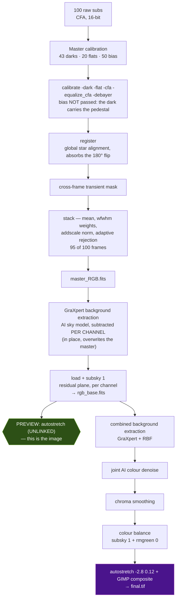

# NGC 7000 — how the coloured, detailed version was made

A worked example: the exact path from 100 duo-band one-shot-colour subs to the image saved as the
preset **`NGC_7000_coloured_detailed_amazing`**, and — the part worth reading — *why* an input that
is overwhelmingly red comes out with rose/red **and** blue/green nebulosity while the stars stay
natural.

Run: `output/NGC_7000/20260901_003014`. Every number below was measured from that run's own files,
not estimated.

---

## 1. What was captured

| | |
|---|---|
| Telescope | William Optics RedCat 51 — `FOCALLEN = 249`, f/4.9 |
| Camera | ZWO **ASI2600MC Air** (IMX571 colour, `BAYERPAT = RGGB`), 6248 × 4176, 3.76 µm |
| Filter | dual-band (Hα + [OIII]) |
| Lights | 100 × 60 s, gain 0, offset 50, −18.5 °C → **1 h 40 m** |
| Calibration | 43 darks (60 s, −20 °C), 20 flats (15 s), 50 bias |
| Scale | **3.116 ″/px**, field **5.4° × 3.6°** |

Two facts about this data drive everything downstream:

- **The sky is 11 ADU above the bias pedestal** (510 vs 499), i.e. ~8.4 e⁻ in 60 s. That is
  *read-noise limited*, not sky limited — the duo-band filter is doing its job.
- **The signal is Hα-dominant.** After calibration and debayering, the plane medians are
  `R = 13.88`, `G = 12.78`, `B = 6.99` ADU. Red leads, and blue trails badly.

The session also crosses the meridian: 34 subs at position angle −90.40°, 66 at +89.39°. That is a
**180° field rotation**, not a rotator move, so the flats stay valid for every sub and Siril's star
registration absorbs it (99/100 frames registered, 1 dropped for no star match).

---

## 2. The pipeline for this image



The green node is the image this document is about. It is **`300_combined`** — a milestone preview
of the *linear* composite — not `final.tif` (purple). They diverge, and the divergence is the
answer to the colour question.

---

---

## 3. What each step actually achieves

The diagram names the commands; this is what they are *doing to the photons*.

### Master calibration — separate what the sensor added from what the sky sent

Stack each calibration set with count-adaptive rejection (percentile ≤ 7 frames, winsorized 8–49,
GESD ≥ 50). A single dark is as noisy as a single light, so subtracting it would *add* noise;
averaging N of them drops that noise ∝ 1/√N until the master is essentially the **deterministic**
part of the sensor's output — thermal current, read pedestal, per-pixel sensitivity — with the
random part averaged away.

### Calibrate — subtract what was added, divide what was multiplied

$$\text{light} = \frac{\text{raw} - \text{dark}}{\text{normalise}(\text{flat})}$$

Two physically different corrections. The dark is **additive** (thermal electrons accumulate
regardless of light), so it is subtracted. The flat is **multiplicative** (vignetting and dust
attenuate a fraction of the light reaching each pixel), so it is divided, after normalising to mean
1 so the overall level is untouched. The bias is *not* passed here — a master dark already contains
the pedestal, and passing both removes it twice.

Crucially this runs **CFA-aware with the debayer last** (`-cfa -equalize_cfa -debayer`): each master
is applied to the sensor's own pixels. Debayer first and every hot pixel and dust shadow has already
been smeared across four interpolated neighbours before you try to correct it.

### Register — put 100 different pixel grids onto one

Detect stars per frame, match them by **triangle similarity** (invariant to rotation, translation
and scale, so it does not need to know about the meridian flip), fit a homography from the matched
pairs, and resample. This is why a 180° field rotation costs nothing: the matcher never assumed an
orientation. One frame failed to match enough stars and was dropped — 99/100.

### Cross-frame transient mask — use the other frames as the truth

For each pixel, take the median and MAD **across the registered stack**, and replace values that sit
more than `trail_mask_k`·MAD away with the median. A satellite is bright in one frame and absent in
99, so it fails that test; a star is in all 100 and passes. It is outlier rejection in the *time*
axis rather than the spatial one.

On this data it masked 26.4 % of pixels and found **0 trail segments** — at 8.4 e⁻ of signal the
per-pixel scatter is comparable to the signal, so the test cannot separate them. See §7.

### Stack — trade 100 exposures for one deep one

Normalise the frames onto a common scale (`addscale`: additive offset + multiplicative gain, so a
sub taken through thinner sky still combines correctly), weight by `wfwhm` (sharper subs count for
more), reject remaining outliers, then average. Averaging N independent frames improves SNR by
**√N** — 95 frames ≈ **9.7×** less noise than one sub. That is the entire reason for stacking.

### GraXpert background extraction — remove the sky without removing the object

The hard part of gradient removal is that the gradient and the nebula are both smooth and both
faint. A polynomial fit has no notion of which is which: raise its degree enough to follow an
asymmetric gradient (amp glow in one corner, light pollution from one horizon) and it starts fitting
the nebula and subtracting it. GraXpert's model is **trained** to distinguish sky from object, so it
can follow a complex background and leave extended nebulosity standing. Subtracted per channel,
in place, before anything else sees the master.

### `subsky 1` — the residual tilt

A degree-1 (planar) fit on background samples, per channel. GraXpert has already taken the
structure; this only levels what is left.

### autostretch — make a linear image visible

The signal occupies the bottom fraction of a percent of the range (sky 11 ADU of 65535). A linear
display shows black. Autostretch applies a **midtone transfer function**: the shadow point is set
≈2.8σ below the background, and the midtone is solved so the background lands on a chosen target,
which lifts the faint end enormously while compressing the bright end so stars do not blow out.

Whether that is computed **per channel or once for all three** is the single most consequential
choice in this document — see §4.

## 4. Where the colours come from

### The input really is almost all red

Through a dual-band filter on a Bayer sensor, Hα (656 nm) lands on the **red** pixels and [OIII]
(500.7 nm) on the **green and blue** ones. On NGC 7000, Hα dominates — hence `R = 13.88` against
`B = 6.99`. A naive rendering of that is a uniformly red-brown frame, which is what a single sub
looks like.

### Step 1 — GraXpert removes the *additive* sky, per channel

`extractBackgroundAI` (`internal/pipeline/enhance.go`) is the **primary** gradient removal, and it
runs on the stacked master *before* anything else sees it. GraXpert's neural network estimates the
sky — light-pollution gradient, amp glow, moon glow, residual vignetting — and subtracts it, **per
channel**. The sky glow, and the duo-band filter's own red pedestal, are additive and smooth, so
they come off. What survives is not "the red image minus a constant" but the **differential**
signal: how much each channel departs from its own local background.

This is the single biggest contributor to the image not being uniformly red, and it happens two
steps upstream of the preview.

### Step 2 — `subsky 1` cleans up the residual

At the combine step the pipeline adds a degree-1 (planar) `subsky`, again per channel.
`backgroundDegree` returns **1** whenever the AI background ran — GraXpert has already taken the
complex gradient, so this is a gentle residual tilt correction, not a second full extraction.

### Step 3 — the *unlinked* autostretch is what reveals the colour

`siril.PreviewScript` (`internal/siril/scripts.go`) issues a bare command:

```go
b.WriteString("autostretch\n")     // no -linked
```

Siril's autostretch is **unlinked by default** — it computes and applies a separate transfer curve
per channel, pulling each one's background to the same target. That single choice is what turns a
red frame into a coloured one:

- The **residual** global red bias is divided out — R, G and B are all normalised to the same sky level, so
  the overall cast disappears.
- What is left visible is each pixel's *relative* excess:
  - where Hα is stronger than the field average → **rose / red**
  - where [OIII] contributes relatively more (the Pelican's rim, the bright central body) → the
    green and blue channels rise faster than red → **blue / green / teal**
- **Stars stay natural.** A star is broadband: it lights R, G and B together, so after per-channel
  normalisation its ratios come back near neutral — white, with genuine stellar tints surviving
  (orange giants stay orange, hot stars stay blue). The nebula is chromatic; the stars are not; the
  stretch separates them for free.

> The colour is not painted on. It is the *relative* line strength that was always in the data,
> made visible by removing the additive sky and then normalising the channels against each other.

### Why the final image looks different

The finish deliberately does other things, and three of them work against that palette:

| finish step | effect on colour |
|---|---|
| `AutostretchCmd(linked, 0.12)` → `autostretch -2.8 0.12` | target background 0.12 vs the preview's default ~0.25 — much darker, so faint nebulosity sinks |
| `rmgreen 0` (SCNR) inside the neutralisation fallback | **removes green** — which is exactly where [OIII] lives, so the teal goes |
| `sky_chroma_flatten_px`, `chroma_bg_smooth_px` | flatten and smooth chroma, reducing local colour contrast |

That is why `300_combined` can look richer than `final.tif` on this data. It is not that the finish
is broken — it is tuned for broadband LRGB, where SCNR removes a genuine green *cast* rather than a
genuine green *signal*.

---

## 5. Reproducing it

Saved as the favourite preset **`NGC_7000_coloured_detailed_amazing`** (user preset id 32):

```json
{
  "mode": "nebula", "format": "image",
  "color_calibration": false, "denoise": true,
  "focal_mm": 250, "pixel_um": 3.76,
  "params": {
    "background_level": 0.12, "saturation": 0.45, "crop_frac": 0.05,
    "chroma_smooth_px": 3, "chroma_bg_smooth_px": 8,
    "sky_chroma_flatten_px": 8, "trail_mask_k": 3, "denoise_chroma": 0.85
  }
}
```

Launching a run (`target` is per-capture, so it is not part of the preset):

```bash
curl -sS -XPOST localhost:8080/api/jobs -H 'content-type: application/json' -d '{
  "path": "input/NGC7000", "mode": "nebula", "format": "image",
  "target": "NGC7000", "focal_mm": 250, "pixel_um": 3.76,
  "color_calibration": false,
  "params": {"background_level":0.12,"saturation":0.45,"crop_frac":0.05,
             "chroma_smooth_px":3,"chroma_bg_smooth_px":8,
             "sky_chroma_flatten_px":8,"trail_mask_k":3,"denoise_chroma":0.85}}'
```

**`focal_mm` is not optional on this rig.** The engine defaults to 740 mm / 3.8 µm, and the guard
that normally drops another camera's optics compares *pixel size* with a 5 % tolerance — 3.76 vs
3.8 is 1 %, so it stays silent and hands the solver 740 mm for a 250 mm scope. Nothing warns.

---

## 6. Getting the stages at full resolution

The timeline previews under `previews/` are **half-scale** 8-bit PNGs. To get any preserved stage at
native resolution, as PNG or TIFF:

```bash
# what this run can export, in pipeline order
curl -sS localhost:8080/api/jobs/736/stages | python3 -m json.tool

# render one at full resolution
curl -sS -XPOST localhost:8080/api/jobs/736/stages/export \
  -H 'content-type: application/json' -d '{"key":"stacked_RGB","format":"tif"}'
# → {"path":"…/export/stacked_RGB.tif"}, then fetch it with GET /api/file?path=…
```

Only stages whose source **still holds what its label claims** are offered. Several linear
intermediates are processed *in place* — `rgb_base.fits` is background-extracted, denoised,
chroma-smoothed and colour-calibrated on top of itself — so a stage whose pixels were overwritten is
not offered rather than silently handed back under the wrong name. See
`internal/pipeline/stageexport.go`.

---

## 7. Known limitations of this particular run

- **The flats are under-exposed**: median 2.7 % of full scale against the engine's own 8 % minimum,
  and the QC flagged every one. Harmless here (flat noise lands ~9× below the stack's noise floor at
  this signal level) but the easiest capture-side improvement available.
- **Gain 0 is the wrong choice** for a duo-band filter this dark. The data is read-noise limited;
  gain 100 roughly halves read noise for the same exposure.
- **`trail_mask_k: 3` masked 26.4 % of every frame and found 0 trail segments.** It costs signal and
  half the stacking time for nothing on data this faint — `trail_mask_k: 0` is better here, and is
  what the sibling preset `NGC_7000_natural_clean` uses.
- The **stack edge** from the meridian flip reaches past the 12 % auto-trim; `crop_frac: 0.05`
  removes what survives into the export.
