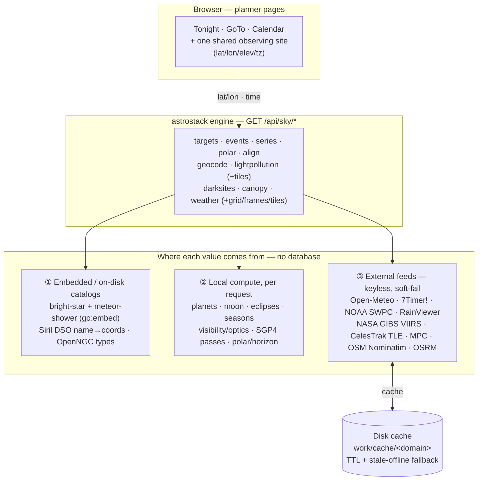

# The session planner

Three UI pages answer "what should I shoot tonight, how do I align, and when do events happen":
**Tonight** (`/tonight`), **GoTo** (`/goto`) and **Calendar** (`/calendar`). The observing site
(map / address / geolocation) is chosen once and shared across all three; weather and
light-pollution overlays come from keyless public APIs by default. This page explains where every
value comes from and what is cached versus stored.

## The pages

| Page | Route | What it's for |
|------|-------|---------------|
| **Tonight** | `/tonight` | Ranks tonight's deep-sky targets for your location, gear and the moon/darkness conditions. Filters by type/score/framing, camera **or** eyepiece (visual) mode, altitude charts, a sky map with light-pollution and **animated weather layers** (self-rendered forecast grid + live rain radar, one unified time scrubber), and a meteoblue-style astro-weather panel (clouds, seeing, transparency, jet stream, Kp, air quality — with a worded "Tonight" verdict). Built-in **Polar** (polar-scope reticle for right now) and **Dark sky** (dark-site finder scoring darkness, tree-horizon openness and by-road driving distance) tabs. |
| **GoTo** | `/goto` | Computes a well-spread, ordered set of **mount-alignment stars** for your GoTo routine — six mount profiles (SynScan / Celestron, EQ / Alt-Az), only stars your hand controller actually offers, two-phase align+calibration for Celestron EQ. Walk the sequence interactively — center/skip — and the server re-plans around your choices. Includes the mise-en-station (polar alignment) helper and an interactive "find it in the sky" map. |
| **Calendar** | `/calendar` | An astronomical-events almanac: eclipses, moon phases, meteor showers, conjunctions, oppositions, equinoxes, ISS passes, comets… as a month calendar over a date window, or the next N of a single type — each scored for your site and gear. |

## Data flow

## The sky-data API

Every planner value is served read-only under `GET /api/sky/*` (see [api.md](api.md)); the browser
passes the shared observing site and the engine fans out:

| Endpoint (all `GET`) | Feeds | Data source | Local store |
|----------------------|-------|-------------|-------------|
| `/api/sky/targets` | Tonight — ranked targets | Siril DSO catalog + OpenNGC types/names + visibility/optics compute (light pollution folded into every score) | in-mem catalog |
| `/api/sky/events` · `/series` | Calendar | ephemeris compute + embedded showers + CelesTrak TLE + MPC comets | disk cache |
| `/api/sky/align` (+ `/profiles`) | GoTo — alignment sequences | embedded `brightstars.csv` + hand-controller catalogs + max-spread compute | embedded |
| `/api/sky/polar` | Polar reticle | celestial-pole geometry (compute) | — |
| `/api/sky/lightpollution` (+ `/atlas`, `/tiles/…`) | SQM/Bortle scores + map overlay | keyed API → offline atlas → NASA GIBS VIIRS → default | mem + disk (~720 h) |
| `/api/sky/darksites` | Dark-sky finder | light pollution × terrain elevation × **tree-canopy horizon** × **the chosen night's forecast** × OSRM driving distance | inherits caches |
| `/api/sky/nights` | Night picker | twilight + Moon compute (no upstream) | — |
| `/api/sky/canopy/atlas` | canopy atlas status/build | ETH GlobalCanopyHeight download | disk atlas |
| `/api/sky/weather` (+ `/grid`, `/grid/frames`, `/tiles/…`) | Astro-weather panel + animated map layers | Open-Meteo + Air-Quality + ensemble + 7Timer! + NOAA SWPC; rain radar tiles from RainViewer | mem + disk (~30 min) |
| `/api/sky/geocode` | Site picker | OpenStreetMap Nominatim | per request |

Every feed is **keyless by default and soft-fails**: a dead upstream falls back to the disk cache
(even stale), then to the offline atlas / local compute / a configurable default — no `/api/sky/*`
call returns a hard error, and one feed down never takes the panel down. An optional calibrated
light-pollution provider takes a key, read **server-side only** (never sent to the UI, never
logged).

Every one of these services, with its licence and attribution requirements, is listed in
[third-party.md](third-party.md) — including the two that bind a redistributor (Open-Meteo's free tier
is non-commercial CC BY 4.0; the HYG/ATHYG/OpenNGC catalogues are CC BY-SA).

Weather and the rain radar feed the overlays and the panel, and are **not** folded into target or
event visibility scores — those describe a site, and a forecast would make them stale within hours.
Light pollution is. The **one exception** is the dark-sky finder: "where should I go on Saturday" is
a question about the sky, so `/api/sky/darksites` blends the selected night's forecast into its
ranking by default (`ASTRO_DARKSKY_WEATHER_WEIGHT`, adjustable from the page, 0 = off). It stays
soft-fail like everything else — no forecast means a terrain-only ranking and a warning, never a
zeroed score. See `docs/architecture.md` → "Ranking dark sites for a night".

## Offline atlases

Two datasets can be fully offline for field use, built once by recipe:

| Recipe | Builds |
|---|---|
| `just update-light-pollution-data [REGION]` | the sky-brightness atlas (`work/lightpollution/atlas.bin`; france/europe/world) |
| `just update-canopy-data` | the tree-canopy-height atlas the horizon scoring reads |
| `just gen-skymap-data` | the frontend's star map (`skymap.json`, HYG + Stellarium) |

## What's stored where

**Postgres holds imaging data only** (sessions, frames, jobs, masters index, presets). **No sky
datum is ever persisted**: values are embedded in the binary, computed per request, or fetched
from keyless feeds and cached under `work/cache/<domain>` with TTL + stale-offline fallback.
Delete `work/cache/` and everything re-fetches or recomputes — nothing is lost.

Site + rig defaults (`ASTRO_LAT`/`ASTRO_LON`/`ASTRO_TIMEZONE`, aperture/sensor/eyepieces) and all
provider URLs/TTLs are configurable — see [configuration.md](configuration.md) and `.env.example`.
